Refer to # fiware-dsc

> ⚠️ This documentation is being written and is currently uncomplete.

<ul>
    <li>
        <a href="#getting-started">Getting Started</a>
        <ul>
            <li><a href="#prerequisites">Prerequisites</a></li>
            <li>
                <a href="#deployment">Deployment</a>
                <ul>
                    <li><a href="#clone-the-repository">Clone the repository</a></li>
                    <li><a href="#create-environment-variables">Create environment variables</a></li>
                    <li><a href="#generate-the-did">Generate the DID</a></li>
                    <li><a href="#consumer-configuration">Consumer configuration</a></li>
                    <li><a href="#provider-configuration">Provider configuration</a></li>
                    <li><a href="#keycloak-configuration">Keycloak configuration</a></li>
                    <li><a href="#onboarding">Onboarding</a></li>
                </ul>
            </li>
        </ul>
    </li>
    <li>
        <a href="#usage">Usage</a>
        <ul>
            <li>
                <a href="#provider">Provider</a>
                <ul>
                    <li><a href="#walt-id-ssi-kit-configuration">walt.id SSI Kit configuration</a></li>
                    <li><a href="#credentials-config-service-configuration">Credentials config service configuration</a></li>
                    <li><a href="#trusted-issuers-list-configuration">Trusted issuers list configuration</a></li>
                    <li><a href="#keycloak-configuration-1">Keycloak configuration</a></li>
                    <li><a href="#ouranos-ws-configuration">ouranos-ws configuration</a></li>
                </ul>
            </li>
            <li>
                <a href="#provider">Consumer</a>
                <ul>
                    <li><a href="#human-to-machine-(h2m)">Human to machine</a></li>
                    <li><a href="#machine-to-machine-(m2m)">Machine to machine</a></li>
                </ul>
            </li>
        </ul>
    </li>
    <li>
        <a href="#annexes">Annexes</a>
        <ul>
            <li><a href="#generate-a-vc-and-add-it-to-the-wallet">Generate a VC and add it to the Wallet</a></li>
            <li><a href="#create-a-client-in-keycloak">Create a client in Keycloak</a></li>
        </ul>
    </li>
</ul>

## Getting Started

### Prerequisites

- [Debian](https://www.debian.org/) 12
- [Docker Engine](https://docs.docker.com/engine/install/debian/)
- [Docker Compose](https://docs.docker.com/compose/install/) (included with Docker Engine)
- [Certbot](https://certbot.eff.org/instructions?ws=other&os=debianbuster)
- [Git](https://git-scm.com/) `sudo apt install git`
- wget `sudo apt install wget`

### Deployment

> In our example, we will use the domain name example.com. Replace it with yours wherever it appears.

#### Clone the repository

- Clone this repository

    ```
    git clone https://github.com/faubourg-numerique/fiware-dsc.git
    ```

- Access the cloned repository

    ```
    cd fiware-dsc
    ```

#### Create environment variables

- Create and edit the environment file

    ```
    cp ./.env.example ./.env
    ```

#### Generate the DID

- Create type A DNS entry for the following domain

    - example.com

- Generate HTTPS certificates

    ```
    sudo certbot certonly --standalone --key-type rsa -d example.com
    ```

- Copy certificates

    - `cp /etc/letsencrypt/live/example.com/cert.pem ./certificates/certificate.pem`
    - `cp /etc/letsencrypt/live/example.com/chain.pem ./certificates/certificate-chain.pem`
    - `cp /etc/letsencrypt/live/example.com/fullchain.pem ./certificates/full-certificate-chain.pem`
    - `cp /etc/letsencrypt/live/example.com/privkey.pem ./certificates/private-key.pem`

- Create **./tls.crt**

    ```
    cp ./certificates/full-certificate-chain.pem ./tls.crt
    ```

- Create the **./config/waltid-ssikit/signatory.conf** config file

    ```
    cp ./config/waltid-ssikit/signatory.conf.example ./config/waltid-ssikit/signatory.conf
    ```

- Run the walt.id SSI Kit

    ```
    sudo docker compose -f docker-compose-waltid-ssikit.yml up -d
    ```

- Import the private key into walt.id SSI Kit

    ```
    curl --header "Content-Type: text/plain" --data-binary "@./certificates/private-key.pem" "http://localhost:7000/v1/key/import"
    ```

- Create a web DID

    ```
    curl --location "http://localhost:7000/v1/did/create" --header "Content-Type: application/json" --data-binary @- << EOF
    {
        "method": "web",
        "keyAlias":"00000000000000000000000000000000",
        "domain": "example.com",
        "x5u": "https://example.com/tls.crt"
    }
    EOF
    ```

    > The key alias is the ID returned by walt.id SSI Kit during the previous request.

- Save the DID document

    ```
    wget -O ./did.json http://localhost:7000/v1/did/did:web:example.com
    ```

- Stop the walt.id SSI Kit

    ```
    sudo docker compose -f docker-compose-waltid-ssikit.yml down
    ```

- Add `https://example.com/tls.crt` to `verificationMethod[0].publicKeyJwk.x5u` in **did.json**

    ```json
    {
        "verificationMethod": [
            {
                "publicKeyJwk": {
                    "x5u": "https://example.com/tls.crt"
                }
            }
        ]
    }
    ```

    > You should use a [JSON formatter](https://jsonformatter.org/) to make the file readable.

- Host the following files on example.com with an HTTPS web server

    - **/tls.crt**
    - **/.well-known/did.json**

- Edit the following fields of the **./config/waltid-ssikit/signatory.conf** config file

    - `proofConfig.issuerDid`
    - `proofConfig.issuerVerificationMethod`
    - `proofConfig.domain`
    - `proofConfig.nonce`

    > The DID can be found in **./did.json**. The nonce have to be a unique identifier which can for example be a [UUID](https://www.uuidgenerator.net/).

- Update the `DID`, `CERTIFICATE` and `PRIVATE_KEY` environment variables of the **./.env** file

#### Consumer configuration

- Create type A DNS entries for the following subdomain

    - keycloak.example.com

- Generate HTTPS certificates

    - `sudo certbot certonly --standalone -d keycloak.example.com`

- Create and edit the **./config/nginx/nginx-consumer.conf** config file

    ```
    cp ./config/nginx/nginx-consumer.conf.example ./config/nginx/nginx-consumer.conf
    ```

- Run the consumer docker compose script

    ```
    sudo docker compose -f docker-compose-consumer.yml up -d
    ```

- [Configure Keycloak](#keycloak-configuration)

- [Perform the onboarding](#onboarding)

#### Provider configuration

- Create type A DNS entries for the following subdomain

    - keycloak.example.com
    - idm.example.com
    - as.example.com
    - vc-verifier.example.com
    - context-broker.example.com

- Generate HTTPS certificates

    - `sudo certbot certonly --standalone -d keycloak.example.com`
    - `sudo certbot certonly --standalone -d idm.example.com`
    - `sudo certbot certonly --standalone -d as.example.com`
    - `sudo certbot certonly --standalone -d vc-verifier.example.com`
    - `sudo certbot certonly --standalone -d context-broker.example.com`

- Create and edit the **./config/nginx/nginx-provider.conf** config file

    ```
    cp ./config/nginx/nginx-provider.conf.example ./config/nginx/nginx-provider.conf
    ```

- Create and edit the **./config/activation-service/as.yml** config file

    ```
    cp ./config/activation-service/as.yml.example ./config/activation-service/as.yml
    ```

- Create and edit the **./config/vc-verifier/server.yaml** config file

    ```
    cp ./config/vc-verifier/server.yaml.example ./config/vc-verifier/server.yaml
    ```

- Run the provider docker compose script

    ```
    sudo docker compose -f docker-compose-provider.yml up -d
    ```

- [Configure Keycloak](#keycloak-configuration)

- [Perform the onboarding](#onboarding)

#### Keycloak configuration

- Create the **./config/keycloak/realms/vc-issuer.json** realm file

    ```
    cp ./config/keycloak/realms/vc-issuer.json.example ./config/keycloak/realms/vc-issuer.json
    ```

- Edit the following fields of the **./config/keycloak/realms/vc-issuer.json** realm file

    - `clients[5].attributes.vc_gx:legalName` (line 767)
    - `clients[5].attributes.vc_subjectDid` (line 768)

- Login to the Keyrock administration console

    <details>
        <summary>Image</summary>
        
    </details>

    <details>
        <summary>Image</summary>
        
    </details>

- Create a realm **vc-issuer**

    <details>
        <summary>Image</summary>
        
    </details>

    <details>
        <summary>Image</summary>
        
    </details>

- Go to the **Users** tab

    <details>
        <summary>Image</summary>
        
    </details>

- Create an **admin** user

    <details>
        <summary>Image</summary>
        
    </details>

    <details>
        <summary>Image</summary>
        
    </details>

    > It is important to fill in all fields (email, first name, last name...)

- Go to the **Credentials** tab

    <details>
        <summary>Image</summary>
        
    </details>

- Set a password

    <details>
        <summary>Image</summary>
        
    </details>

    <details>
        <summary>Image</summary>
        
    </details>

    <details>
        <summary>Image</summary>
        
    </details>

- Go to the **Role mapping** tab

    <details>
        <summary>Image</summary>
        
    </details>

- Click the **Assign role** button

    <details>
        <summary>Image</summary>
        
    </details>

- Filter the roles by clients

    <details>
        <summary>Image</summary>
        
    </details>

- Assin the **LEGAL_REPRESENTATIVE** role

    <details>
        <summary>Image</summary>
        
    </details>

#### Onboarding

- Refer to [this annex](#generate-a-vc-and-add-it-to-the-wallet) to generate and add to the Wallet the following verifiable credentials:

    - GaiaXParticipantCredential ldp_vc + FIWARE Compliance Service
    - NaturalPersonCredential ldp_vc

- Go to the [OnBoarding Portal](https://onboarding-portal.dsba.fiware.dev/)

- Click on **Login with VC**

    <details>
        <summary>Image</summary>
        
    </details>

- Scan the QR code with the wallet

- Click on the **Send Credential** button

    <details>
        <summary>Image</summary>
        
    </details>

- Click on the **+** button

## Usage

### Provider

#### walt.id SSI Kit configuration

- Create the following vc template file **ExampleCredential.json** and place it inside **vc-templates**

    ```json
    {
        "@context": [
            "https://www.w3.org/2018/credentials/v1"
        ],
        "credentialSchema": {
            "id": "https://raw.githubusercontent.com/FIWARE-Ops/tech-x-challenge/main/schema.json",
            "type": "FullJsonSchemaValidator2021"
        },
        "credentialSubject": {
            "type": "gx:NaturalParticipant",
            "familyName": "User",
            "firstName": "User",
            "lastName": "User",
            "roles": [
                {
                    "names": [
                        "LEGAL_REPRESENTATIVE"
                    ],
                    "target": "did:web:onboarding"
                }
            ]
        },
        "id": "urn:uuid:00000000-0000-0000-0000-000000000000",
        "issued": "2023-01-01T00:00:00Z",
        "issuer": "did:web:example.com",
        "validFrom": "2023-01-01T00:00:00Z",
        "issuanceDate": "2023-01-01T00:00:00Z",
        "type": [
            "ExampleCredential"
        ]
    }
    ```

- Edit `id`, `issuer`, and `type[0]`

#### Credentials config service configuration

- Edit `id` and `oidcScopes.default[2].type` then create the entry

    ```
    curl --location "http://localhost:8090/service" --header "Content-Type: application/json" --data-binary @- << EOF
    {
        "id": "example",
        "defaultOidcScope": "default",
        "oidcScopes": {
            "default": [
                {
                    "type": "VerifiableCredential",
                    "trustedParticipantsLists": [
                        "https://tir.dsba.fiware.dev"
                    ],
                    "trustedIssuersLists": []
                },
                {
                    "type": "LegalPersonCredential",
                    "trustedParticipantsLists": [
                        "https://tir.dsba.fiware.dev"
                    ],
                    "trustedIssuersLists": []
                },
                {
                    "type": "ExampleCredential",
                    "trustedParticipantsLists": [
                        "https://tir.dsba.fiware.dev"
                    ],
                    "trustedIssuersLists": [
                        "http://trusted-issuers-list:8080"
                    ]
                }
            ]
        }
    }
    EOF
    ```

- Check that the entry has been created

    ```
    curl "http://localhost:8090/service/example"
    ```

#### Trusted issuers list configuration

- Edit `did`, `credentials[0].credentialsType`, `credentials[0].claims[0].allowedValues[0].names[0]` and `credentials[0].claims[0].allowedValues[0].target` then create the entry

    ```
    curl --location "http://localhost:8080/issuer" --header "Content-Type: application/json" --data-binary @- << EOF
    {
        "did": "did:web:example.com",
        "credentials": [
            {
                "validFor": {
                    "from": "2022-07-21T17:32:28Z",
                    "to": "2040-07-21T17:32:28Z"
                },
                "credentialsType": "ExampleCredential",
                "claims": [
                    {
                        "name": "roles",
                        "allowedValues": [
                            {
                                "names": [
                                    "EXAMPLE"
                                ],
                                "target": "did:web:example.com"
                            }
                        ]
                    }
                ]
            },
            {
                "validFor": {
                    "from": "2022-07-21T17:32:28Z",
                    "to": "2040-07-21T17:32:28Z"
                },
                "credentialsType": "VerifiableCredential"
            }
        ]
    }
    EOF
    ```

- Check that the entry has been created

    ```
    curl "http://localhost:8080/v4/issuers/did:web:example.com"
    ```

#### Keycloak configuration

- Refer to [this annex](#create-a-client-in-keycloak) to create a client in Keycloak

#### ouranos-ws configuration

- Authenticate to [ouranos-ws](https://app.dscaas.ouranos-ws.com)

- Go to **Administration** → **Authorization registries**

- Click the **+** button to create a new authorization registry

    | Name                   | Value                                                                         |
    |------------------------|-------------------------------------------------------------------------------|
    | Name                   | Example authorization registry                                                |
    | Description            |                                                                               |
    | Identifier             | did:web:example.com                                                           |
    | Certificates           | MIIE5DCCA8ygAwIBAgIS...<br>MIIFFjCCAv6gAwIBAgIR...<br>MIIFFjCCAv6gAwIBAgIR... |
    | Scheme                 | https                                                                         |
    | Host                   | idm.example.com                                                               |
    | Port                   | 443                                                                           |
    | Path                   |                                                                               |
    | Oauth2 token path      | /oauth2/token                                                                 |
    | Delegation path        | /ar/delegation                                                                |
    | Policy path            | /ar/policy                                                                    |
    | Implementation name    | Keyrock                                                                       |
    | Implementation version | 0.0.0                                                                         |

    > If your **full-certificate-chain.pem** file only contains two certificates, repeat the second in the third one's field.

- Go to **Administration** → **Authorization registry grants**

- Click the **+** button to create a new authorization registry grant

    | Name         | Value                                                                         |
    |--------------|-------------------------------------------------------------------------------|
    | Name         | Example authorization registry grant                                          |
    | Description  |                                                                               |
    | Identifier   | did:web:example.com                                                           |
    | Certificates | MIIE5DCCA8ygAwIBAgIS...<br>MIIFFjCCAv6gAwIBAgIR...<br>MIIFFjCCAv6gAwIBAgIR... |
    | Private key  | MIIEvAIBADANBgkqhkiG...                                                       |

- Go to **Administration** → **VC verifiers**

- Click the **+** button to create a new vc verifier

    | Name                             | Value                   |
    |----------------------------------|-------------------------|
    | Name                             | Example vc verifier     |
    | Description                      |                         |
    | Did                              | did:web:example.com     |
    | Scheme                           | https                   |
    | Disable certificate verification | ☐                       |
    | Host                             | vc-verifier.example.com |
    | Port                             | 443                     |
    | Path                             |                         |
    | Implementation name              | Fiware VC Verifier      |
    | Implementation version           | 2.0.5                   |

- Go to **Administration** → **Trusted issuers lists**

- Click the **+** button to create a new trusted issuers list

    > To be reviewed, the trusted issuers list is not publicly accessible.

    | Name                   | Value                        |
    |------------------------|------------------------------|
    | Name                   | Example trusted issuers list |
    | Description            |                              |
    | Scheme                 | https                        |
    | Host                   | til.example.com              |
    | Port                   | 443                          |
    | Path                   |                              |
    | Implementation name    | Fiware Trusted Issuers List  |
    | Implementation version | 0.0.1                        |

- Go to **Administration** → **Context brokers**

- Click the **+** button to create a new context broker

    | Name                             | Value                      |
    |----------------------------------|----------------------------|
    | Name                             | Example context broker     |
    | Description                      |                            |
    | Scheme                           | https                      |
    | Disable certificate verification | ☐                          |
    | Host                             | context-broker.example.com |
    | Port                             | 443                        |
    | Path                             |                            |
    | Multi tenancy enabled            | ☐                          |
    | Pagination max limit             | 1000                       |
    | Implementation name              | Orion-LD                   |
    | Implementation version           | 1.5.1                      |
    | Custom headers                   | ☐                          |

- Go to **Administration** → **Services**

- Click the **+** button to create a new service

    | Name                   | Value                        |
    |------------------------|------------------------------|
    | Name                   | Example service              |
    | Description            |                              |
    | Context broker         | Example context broker       |
    | Authorization required | ☑                            |
    | Authorization mode     | SIOP 2                       |
    | VC verifier            | Example vc verifier          |
    | Trusted issuers list   | Example trusted issuers list |
    | Client id              | example                      |

- Go to **Workspaces**

- Click the **+** button to create a new workspace

    | Name                         | Value                                |
    |------------------------------|--------------------------------------|
    | Name                         | Example workspace                    |
    | Description                  |                                      |
    | Data model name              | example                              |
    | Default data model url       | https://ngsi-ld.ouranos-ws.com/      |
    | Service                      | Example service                      |
    | Temporal services            |                                      |
    | Enable access rules          | ☑                                    |
    | Authorization registry       | Example authorization registry       |
    | Authorization registry grant | Example authorization registry grant |

- Go back to **Workspaces**

- Refer to [this annex](#generate-a-vc-and-add-it-to-the-wallet) to generate and add to the Wallet a **ExampleCredential ldp_vc**

- Click on the QR code button corresponding to **Example workspace**

    <details>
        <summary>Image</summary>
        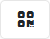
    </details>

- Scan the QR code with the Wallet and click on the **Send credential** button

- Click on the gear button to access the data model

    <details>
        <summary>Image</summary>
        
    </details>

- Click the **+** button to create a new type

    | Name                               | Value                                                                                                                                        |
    |------------------------------------|----------------------------------------------------------------------------------------------------------------------------------------------|
    | Name                               | Streetlight                                                                                                                                  |
    | Description                        |                                                                                                                                              |
    | Url                                | https://ngsi-ld.ouranos-ws.com/Streetlight                                                                                                   |
    | Data model group                   | Unset                                                                                                                                        |
    | Standard data model based          | ☑                                                                                                                                            |
    | Standard data model type           | Smart Data Models                                                                                                                            |
    | Standard data model definition url | https://raw.githubusercontent.com/smart-data-models/dataModel.Streetlighting/76cff6cca0c1bd02946db73e0be7e4ed5b582903/Streetlight/model.yaml |

- Click the down arrow button to import properties

    <details>
        <summary>Image</summary>
        
    </details>

- Select the **name**, **description** and **powerState** properties

- Click on the **Import** button at the end of the page

- Click on the **Types** link to go back to the data model

- Click on the gear button generate the data model

    <details>
        <summary>Image</summary>
        
    </details>

    <details>
        <summary>Image</summary>
        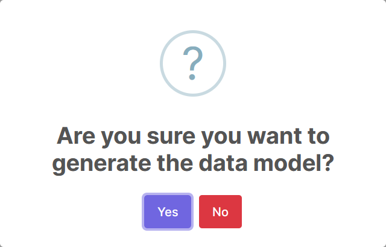
    </details>

    <details>
        <summary>Image</summary>
        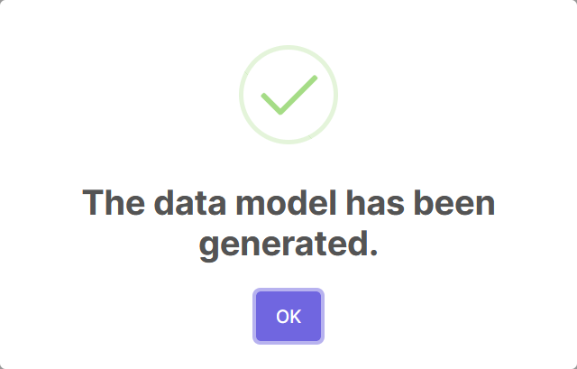
    </details>

- Click on the **Example workspace** button to go back to the workspace

    <details>
        <summary>Image</summary>
        
    </details>

- Click on the **Data services** button

- Click the **+** button to create a new data service

    | Name       | Value                    |
    |------------|--------------------------|
    | Name       | Streetlight data service |
    | Type       | Streetlight              |
    | Properties | powerState               |
    | Actions    | GET                      |
    | Is demand  | ☐                        |
    | Is offer   | ☑                        |

- Click on the **Example workspace** button to go back to the workspace

    <details>
        <summary>Image</summary>
        
    </details>

- Click on the **Roles** button

- Click the **+** button to create a new role

    | Name                       | Value               |
    |----------------------------|---------------------|
    | Name                       | EXAMPLE             |
    | Not before                 | 2024-01-01 00:00    |
    | Not on or after            | 2040-01-01 00:00    |
    | Data service provider id   | did:web:example.com |
    | Verifiable credential type | ExampleCredential   |

- Click the **+** button to create a data service access

    | Name         | Value                    |
    |--------------|--------------------------|
    | Data service | Streetlight data service |

- Click on the **Example workspace** button to go back to the workspace

    <details>
        <summary>Image</summary>
        
    </details>

- Click on the **Contracts** button

- Click the **+** button to create a new contract

    > ⚠️ The stakeholder did and name are those of the consumer.

    | Name                       | Value               |
    |----------------------------|---------------------|
    | Contract type              | Data consumer       |
    | Stakeholder did            | did:web:example.com |
    | Stakeholder name           | Example             |
    | Valid from time            | 1704067200          |
    | Valid to time              | 576545472000        |
    | Verifiable credential type | ExampleCredential   |

- Click the **+** button to create a new contract detail

    | Name | Value   |
    |------|---------|
    | Role | EXAMPLE |

- Click on the contract id (urn:ngsi-ld:Contract:00000000-0000-0000-0000-000000000000) to go back to the contract

- Click on the synchronization button to synchronize the contract

    <details>
        <summary>Image</summary>
        
    </details>

    <details>
        <summary>Image</summary>
        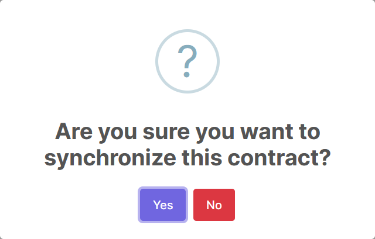
    </details>

    <details>
        <summary>Image</summary>
        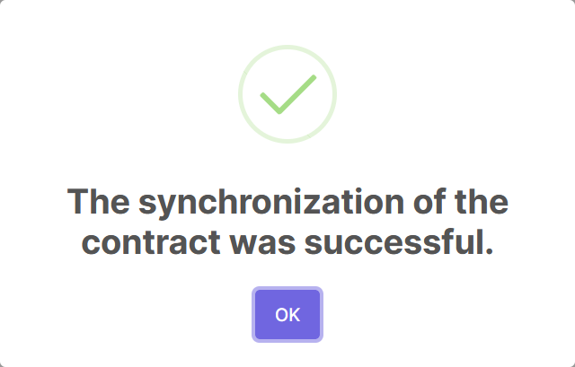
    </details>

- Click on the **Example workspace** button to go back to the workspace

    <details>
        <summary>Image</summary>
        
    </details>

- Click on the **Roles** button

- Click on the **EXAMPLE** link

- Click on the synchronization button to synchronize the role

    <details>
        <summary>Image</summary>
        
    </details>

    <details>
        <summary>Image</summary>
        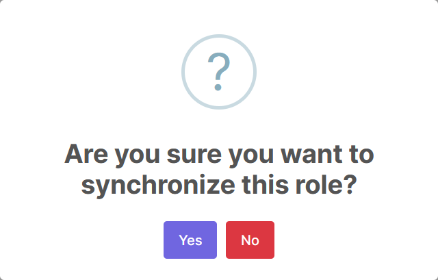
    </details>

    <details>
        <summary>Image</summary>
        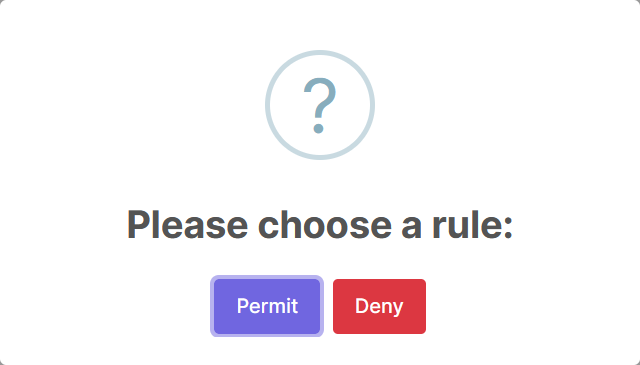
    </details>

    <details>
        <summary>Image</summary>
        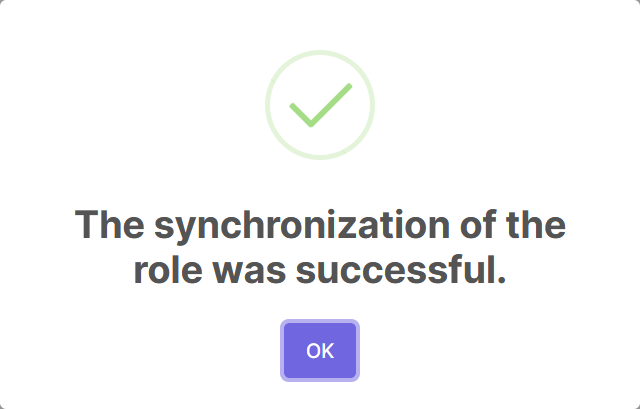
    </details>

#### orion-ld configuration

- Create a streetlight entity

    > Edit the **Link** header and the entity id.

    ```
    curl --location "http://localhost:1026/ngsi-ld/v1/entities" --header "Content-Type: application/json" --header "Link: <https://data-models.dscaas.ouranos-ws.com/example/1/context.jsonld>" --data-binary @- << EOF
    {
        "id": "urn:ngsi-ld:Streetlight:00000000-0000-0000-0000-000000000000",
        "type": "Streetlight",
        "name": {
            "type": "Property",
            "value": "Streetlight 1"
        },
        "description": {
            "type": "Property",
            "value": "Streetlight 1"
        },
        "powerState": {
            "type": "Property",
            "value": "on"
        }
    }
    EOF
    ```

### Consumer

- Refer to [this annex](#create-a-client-in-keycloak) to create a client in Keycloak

- Refer to [this annex](#generate-a-vc-and-add-it-to-the-wallet) to generate and add to the Wallet a **ExampleCredential ldp_vc**

#### Human to machine (H2M)

To write up

#### Machine to machine (M2M)

- Clone the M2M example repository

    ```
    git clone https://github.com/faubourg-numerique/fiware-dsc-m2m-example.git
    ```

- Access the cloned repository

    ```
    cd fiware-dsc-m2m-example
    ```

- Install the dependencies

    ```
    npm install
    ```

- Create and edit the environment file

    ```
    cp ./.env.example ./.env
    ```

- Export the **ExampleCredential** verifiable credential from the Wallet to **verifiable-credential.json**

- Run the script

    ```
    sudo node index.js
    ```

## Annexes

### Generate a VC and add it to the Wallet

> To do this, you will need a computer and a phone.

From the computer:

- Go to the Keycloak account management (https://keycloak.example.com/realms/vc-issuer/account/)

- Click on **Verifiable Credentials**

- Sign in using the **admin** user of the **vc-issuer** realm

- Select the desired verifiable credential from the drop-down list

    > Make sure you choose the verifiable credential with the right type, for example it could be **ldp_vc** or **jwt_vc_json**.

- Click on the **Initiate Credential-Issuance(OIDC4CI)** button

    > A QR code should be displayed. If an error occurs, refresh the page and try again.

From the phone:

- Access the Fiware [wallet](https://demo-wallet.fiware.dev/)

- Click on the **Scan QR** button

    > The operating system and the browser will ask to authorize access to the camera.

- Scan the QR code displayed on the computer screen

    > If an error occurs, refresh the page on the computer, generate a new QR code and try again.

- Click on the **Save** button

- Optional: If a compliancy credential is requested, click on the **Get Compliancy Credential** button at the bottom of the page and click on the corresponding **Compliance Service** button

- Click on the **Home** button

### Create a client in Keycloak

- Create the following Keycloak client file **did_web_example.com.json**

    ```json
    {
        "clientId": "did:web:example.com",
        "description": "did:web:example.com",
        "surrogateAuthRequired": false,
        "enabled": true,
        "alwaysDisplayInConsole": false,
        "clientAuthenticatorType": "client-secret",
        "secret": "**********",
        "redirectUris": [],
        "webOrigins": [],
        "notBefore": 0,
        "bearerOnly": false,
        "consentRequired": false,
        "standardFlowEnabled": true,
        "implicitFlowEnabled": false,
        "directAccessGrantsEnabled": false,
        "serviceAccountsEnabled": false,
        "publicClient": false,
        "frontchannelLogout": false,
        "protocol": "SIOP-2",
        "attributes": {
            "post.logout.redirect.uris": "+",
            "client.secret.creation.time": "1675260539",
            "expiryInMin": "3600",
            "ExampleCredential_claims": "email,firstName,lastName,roles",
            "vctypes_ExampleCredential": "ldp_vc,jwt_vc_json"
        },
        "authenticationFlowBindingOverrides": {},
        "fullScopeAllowed": true,
        "nodeReRegistrationTimeout": -1,
        "defaultClientScopes": [],
        "optionalClientScopes": [],
        "access": {
            "view": true,
            "configure": true,
            "manage": true
        }
    }
    ```

- Edit `clientId`, `description`, and the keys of `attributes.ExampleCredential_claims` and `attributes.vctypes_ExampleCredential`

- Go to the **Clients** tab

    <details>
        <summary>Image</summary>
        
    </details>

- Click on **Import client**

    <details>
        <summary>Image</summary>
        
    </details>

- Select the **did_web_example.com.json** resource file and click on the **Save** button

    <details>
        <summary>Image</summary>
        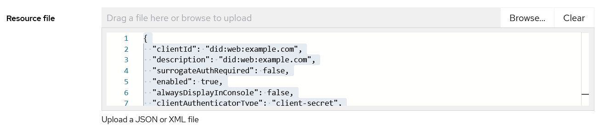
    </details>

    <details>
        <summary>Image</summary>
        
    </details>

- Go back to the **Clients** tab

    <details>
        <summary>Image</summary>
        
    </details>

- Click on **did:web:example.com**

    <details>
        <summary>Image</summary>
        
    </details>

- Go to the **Roles** tab

    <details>
        <summary>Image</summary>
        
    </details>

- Click on the **Create role** button

    <details>
        <summary>Image</summary>
        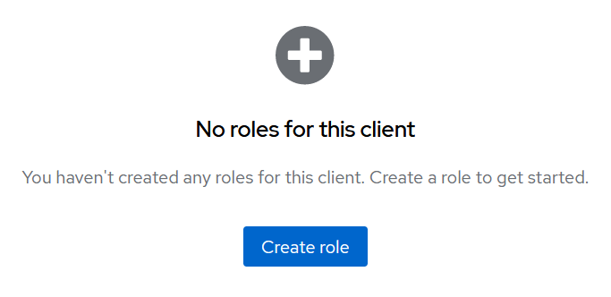
    </details>

- Enter the role name (e.g. EXAMPLE) and click on the **Save** button

    <details>
        <summary>Image</summary>
        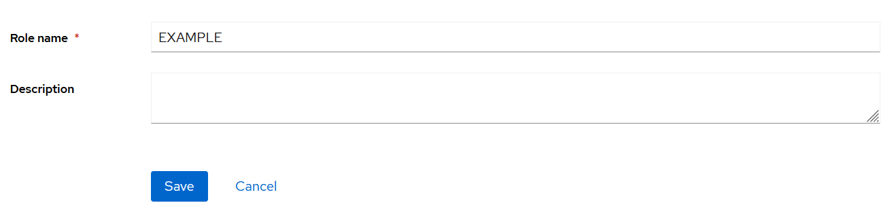
    </details>

- Go to the **Users** tab

    <details>
        <summary>Image</summary>
        
    </details>

- Open the **admin** user details

    <details>
        <summary>Image</summary>
        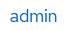
    </details>

- Go to the **Role mapping** tab

    <details>
        <summary>Image</summary>
        
    </details>

- Click the **Assign role** button

    <details>
        <summary>Image</summary>
        
    </details>

- Filter the roles by clients

    <details>
        <summary>Image</summary>
        
    </details>

- Select the **EXAMPLE** role and click the **Assign** button

    <details>
        <summary>Image</summary>
        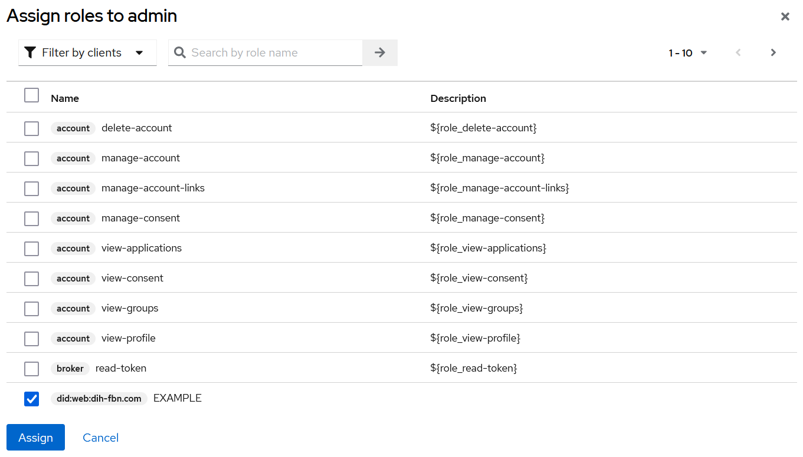
    </details>
