# fiware-dsc

<ul>
    <a href="#getting-started">Getting Started</a>
    <ul>
        <li><a href="#prerequisites">Prerequisites</a></li>
        <li>
            <a href="#deployment">Deployment</a>
            <ul>
                <li><a href="#clone-the-repository">Clone the repository</a></li>
                <li><a href="#create-environment-variables">Create environment variables</a></li>
                <li><a href="#generate-the-did">Generate the DID</a></li>
                <li><a href="#consumer-configuration">Consumer configuration</a></li>
                <li><a href="#provider-configuration">Provider configuration</a></li>
                <li><a href="#keycloak-configuration">Keycloak configuration</a></li>
                <li><a href="#onboarding">Onboarding</a></li>
            </ul>
        </li>
    </ul>
</ul>

## Getting Started

### Prerequisites

- [Debian](https://www.debian.org/) 12
- [Docker Engine](https://docs.docker.com/engine/install/debian/)
- [Docker Compose](https://docs.docker.com/compose/install/) (included with Docker Engine)
- [Certbot](https://certbot.eff.org/instructions?ws=other&os=debianbuster)
- [Git](https://git-scm.com/) `sudo apt install git`
- wget `sudo apt install wget`

### Deployment

> In our example, we will use the domain name example.com. Replace it with yours wherever it appears.

#### Clone the repository

- Clone this repository

    ```
    git clone https://github.com/faubourg-numerique/fiware-dsc.git
    ```

- Access the cloned repository

    ```
    cd fiware-dsc
    ```

#### Create environment variables

- Create and edit the environment file

    ```
    cp ./.env.example ./.env
    ```

#### Generate the DID

- Create type A DNS entry for the following domain

    - example.com

- Generate HTTPS certificates

    ```
    sudo certbot certonly --standalone --key-type rsa -d example.com
    ```

- Copy certificates

    - `cp /etc/letsencrypt/live/example.com/cert.pem ./certificates/certificate.pem`
    - `cp /etc/letsencrypt/live/example.com/chain.pem ./certificates/certificate-chain.pem`
    - `cp /etc/letsencrypt/live/example.com/fullchain.pem ./certificates/full-certificate-chain.pem`
    - `cp /etc/letsencrypt/live/example.com/privkey.pem ./certificates/private-key.pem`

- Create **./tls.crt**

    ```
    cp ./certificates/full-certificate-chain.pem ./tls.crt
    ```

- Create the **./config/waltid-ssikit/signatory.conf** config file

    ```
    cp ./config/waltid-ssikit/signatory.conf.example ./config/waltid-ssikit/signatory.conf
    ```

- Run the walt.id SSI Kit

    ```
    sudo docker compose -f docker-compose-waltid-ssikit.yml up -d
    ```

- Import the private key into walt.id SSI Kit

    ```
    curl --header "Content-Type: text/plain" --data-binary "@./certificates/private-key.pem" "http://localhost:7000/v1/key/import"
    ```

- Create a web DID

    ```
    curl --location "http://localhost:7000/v1/did/create" --header "Content-Type: application/json" --data-binary @- << EOF
    {
        "method": "web",
        "keyAlias":"00000000000000000000000000000000",
        "domain": "example.com",
        "x5u": "https://example.com/tls.crt"
    }
    EOF
    ```

    > The key alias is the ID returned by walt.id SSI Kit during the previous request.

- Save the DID document

    ```
    wget -O ./did.json http://localhost:7000/v1/did/did:web:example.com
    ```

- Stop the walt.id SSI Kit

    ```
    sudo docker compose -f docker-compose-waltid-ssikit.yml down
    ```

- Add `https://example.com/tls.crt` to `verificationMethod[0].publicKeyJwk.x5u` in **did.json**

    ```json
    {
        "verificationMethod": [
            {
                "publicKeyJwk": {
                    "x5u": "https://example.com/tls.crt"
                }
            }
        ]
    }
    ```

    > You should use a [JSON formatter](https://jsonformatter.org/) to make the file readable.

- Host the following files on example.com with an HTTPS web server

    - **/tls.crt**
    - **/.well-known/did.json**

- Edit the following fields of the **./config/waltid-ssikit/signatory.conf** config file

    - proofConfig.issuerDid
    - proofConfig.issuerVerificationMethod
    - proofConfig.domain
    - proofConfig.nonce

    > The DID can be found in **./did.json**. As for the nonce, it is a unique identifier which can for example be a [UUID](https://www.uuidgenerator.net/).

- Update the `DID`, `CERTIFICATE` and `PRIVATE_KEY` environment variables of the **./.env** file

#### Consumer configuration

- Create type A DNS entries for the following subdomain

    - keycloak.example.com

- Generate HTTPS certificates

    - `sudo certbot certonly --standalone -d keycloak.example.com`

- Create and edit the **./config/nginx/nginx-consumer.conf** config file

    ```
    cp ./config/nginx/nginx-consumer.conf.example ./config/nginx/nginx-consumer.conf
    ```

- Run the consumer docker compose script

    ```
    sudo docker compose -f docker-compose-consumer.yml up -d
    ```

- [Configure Keycloak](#keycloak-configuration)

- [Perform the onboarding](#onboarding)

#### Provider configuration

- Create type A DNS entries for the following subdomain

    - keycloak.example.com
    - idm.example.com
    - as.example.com
    - vc-verifier.example.com
    - context-broker.example.com

- Generate HTTPS certificates

    - `sudo certbot certonly --standalone -d keycloak.example.com`
    - `sudo certbot certonly --standalone -d idm.example.com`
    - `sudo certbot certonly --standalone -d as.example.com`
    - `sudo certbot certonly --standalone -d vc-verifier.example.com`
    - `sudo certbot certonly --standalone -d context-broker.example.com`

- Create and edit the **./config/nginx/nginx-provider.conf** config file

    ```
    cp ./config/nginx/nginx-provider.conf.example ./config/nginx/nginx-provider.conf
    ```

- Create and edit the **./config/activation-service/as.yml** config file

    ```
    cp ./config/activation-service/as.yml.example ./config/activation-service/as.yml
    ```

- Create and edit the **./config/vc-verifier/server.yaml** config file

    ```
    cp ./config/vc-verifier/server.yaml.example ./config/vc-verifier/server.yaml
    ```

- Run the provider docker compose script

    ```
    sudo docker compose -f docker-compose-provider.yml up -d
    ```

- [Configure Keycloak](#keycloak-configuration)

- [Perform the onboarding](#onboarding)

#### Keycloak configuration

- Create the **./config/keycloak/realms/vc-issuer.json** realm file

    ```
    cp ./config/keycloak/realms/vc-issuer.json.example ./config/keycloak/realms/vc-issuer.json
    ```

- Edit the following fields of the **./config/keycloak/realms/vc-issuer.json** realm file

    - clients[5].attributes.vc_gx:legalName (line 767)
    - clients[5].attributes.vc_subjectDid (line 768)

- Login to the Keyrock administration console

    <details>
        <summary>Image</summary>
        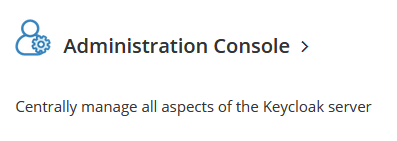
    </details>

    <details>
        <summary>Image</summary>
        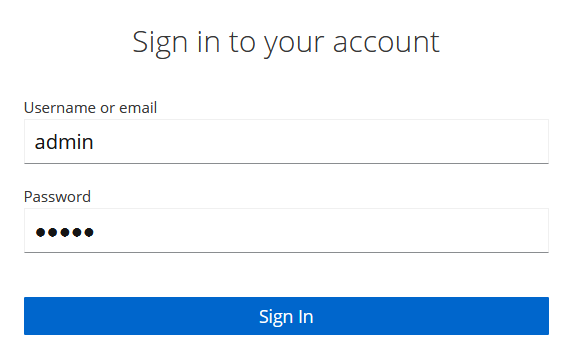
    </details>

- Create a realm **vc-issuer**

    <details>
        <summary>Image</summary>
        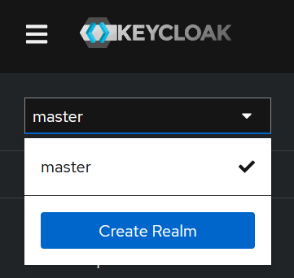
    </details>

    <details>
        <summary>Image</summary>
        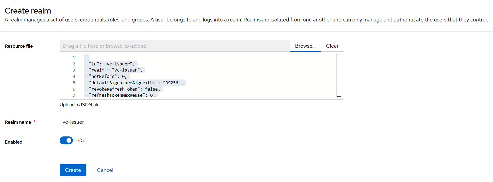
    </details>

- Go to the **Users** tab

    <details>
        <summary>Image</summary>
        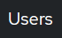
    </details>

- Create an **admin** user

    <details>
        <summary>Image</summary>
        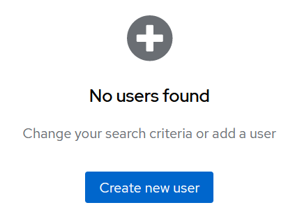
    </details>

    <details>
        <summary>Image</summary>
        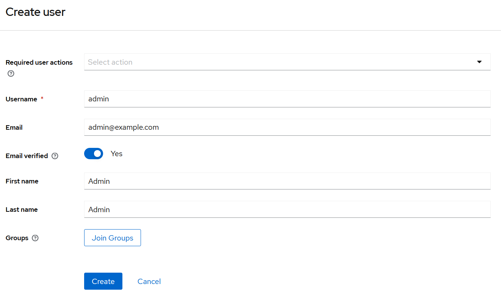
    </details>

    > It is important to fill in all fields (email, first name, last name...)

- Go to the **Credentials** tab

    <details>
        <summary>Image</summary>
        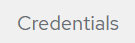
    </details>

- Set a password

    <details>
        <summary>Image</summary>
        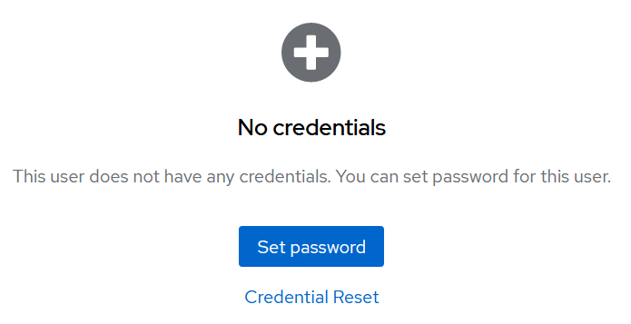
    </details>

    <details>
        <summary>Image</summary>
        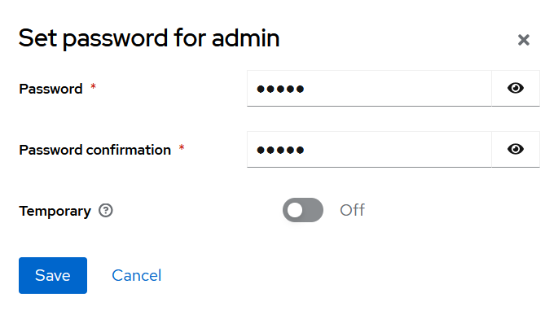
    </details>

    <details>
        <summary>Image</summary>
        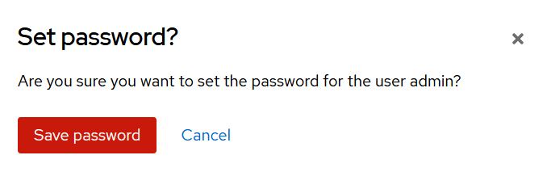
    </details>

- Go to the **Role mapping** tab

    <details>
        <summary>Image</summary>
        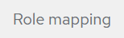
    </details>

- Click the **Assign role** button

    <details>
        <summary>Image</summary>
        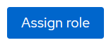
    </details>

- Filter the roles by clients

    <details>
        <summary>Image</summary>
        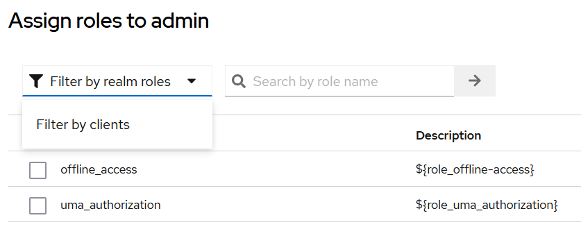
    </details>

- Assin the **LEGAL_REPRESENTATIVE** role

    <details>
        <summary>Image</summary>
        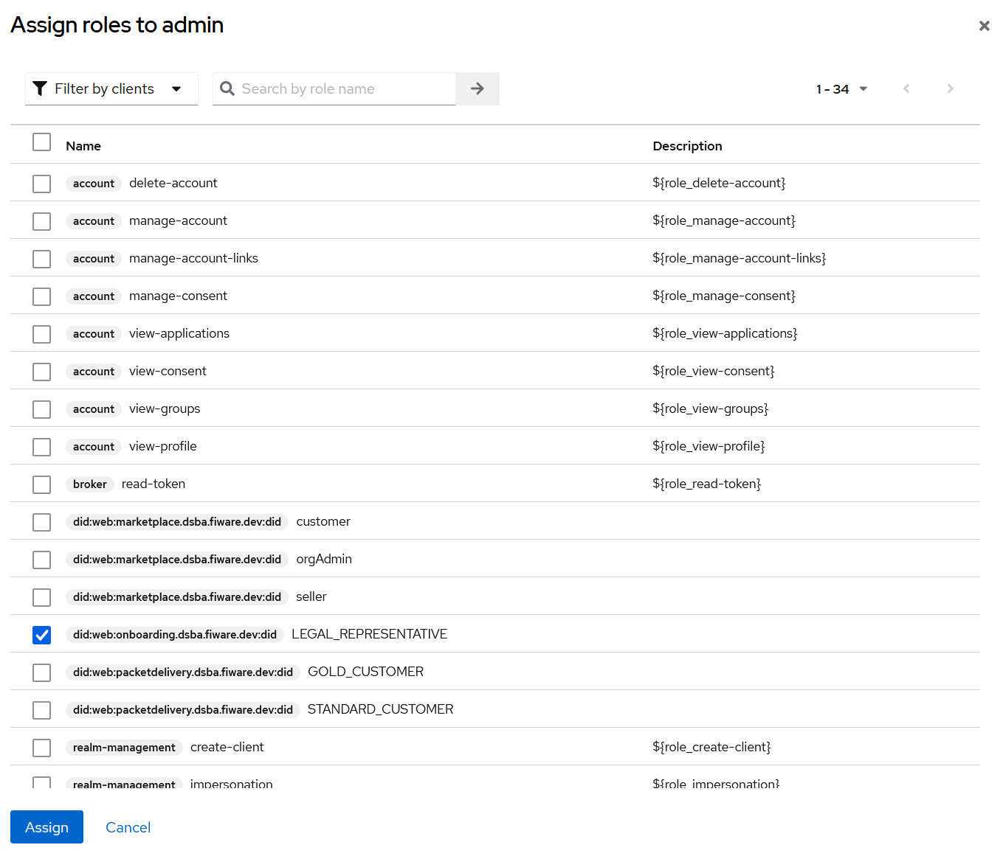
    </details>

#### Onboarding

- From the phone, go to https://demo-wallet.fiware.dev/

    <details>
        <summary>Image</summary>
        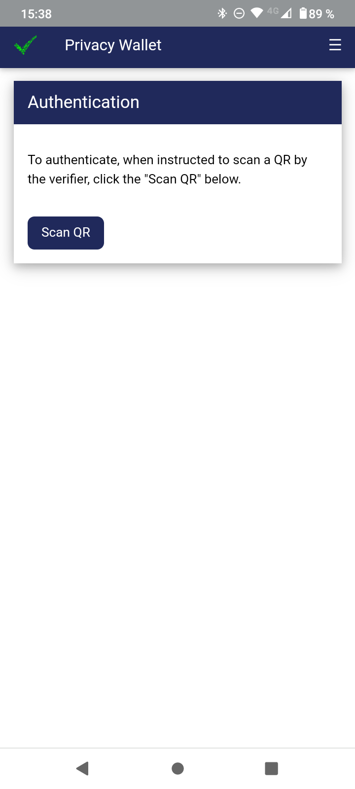
    </details>

- From the computer, go to https://keycloak.example.com/realms/vc-issuer/account/

- Go to **Verifiable Credentials**

    <details>
        <summary>Image</summary>
        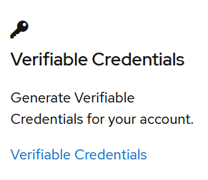
    </details>

- Login using the **vc-issuer** realm **admin** user

    <details>
        <summary>Image</summary>
        
    </details>

- Select **GaiaXParticipantCredential ldp_vc** in the drop-down list

    <details>
        <summary>Image</summary>
        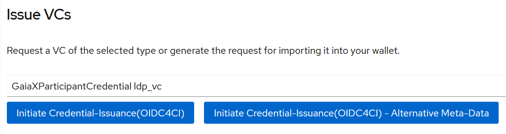
    </details>

- Click on the **Initiate Credential-Issuance(OIDC4CI)** button

    <details>
        <summary>Image</summary>
        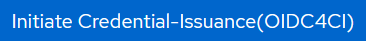
    </details>

    > If an error occurs, refresh the page and try again.

- Click on the **Scan QR** button in the wallet

- Scan the QR code

- Click on the **Save** button

    <details>
        <summary>Image</summary>
        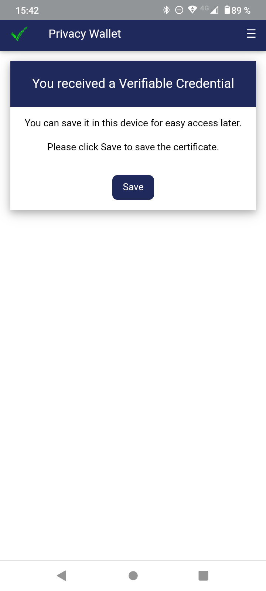
    </details>

- Click on **Get Compliancy Credential** at the bottom of the page

- Click on **FIWARE Compliance Service**

    <details>
        <summary>Image</summary>
        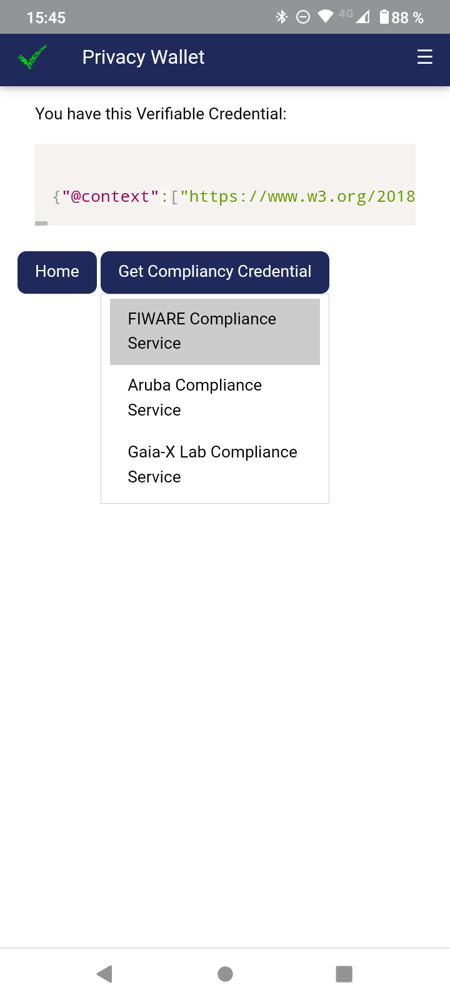
    </details>

- Click on the **Home** button

- Select **NaturalPersonCredential ldp_vc** and click on the **Initiate Credential-Issuance(OIDC4CI)** button

    <details>
        <summary>Image</summary>
        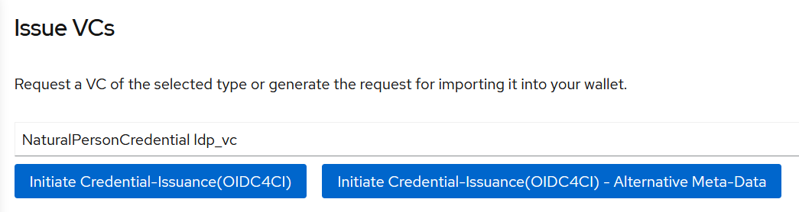
    </details>

- Scan and save this second QR code in the wallet

    > You should now have 3 verifiable credentials in your wallet.

- Go to the [OnBoarding Portal](https://onboarding-portal.dsba.fiware.dev/)

- Click on **Login with VC**

    <details>
        <summary>Image</summary>
        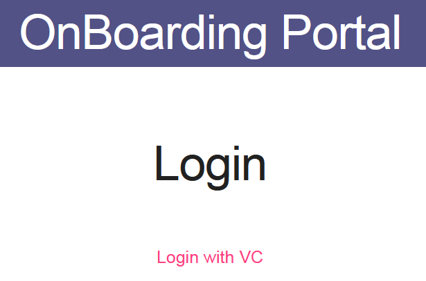
    </details>

- Scan the QR code with the wallet

- Click on the **Send Credential** button

    <details>
        <summary>Image</summary>
        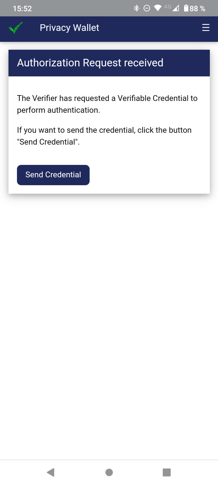
    </details>

- Click on the **+** button
